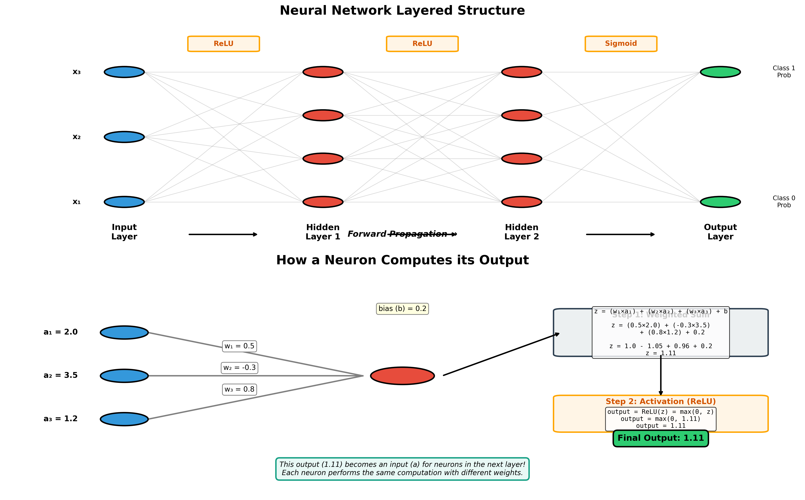

# Neural Networks: Understanding the Layered Architecture

## Introduction

Neural networks are computational models inspired by the human brain's structure. They consist of interconnected layers of artificial neurons that process information through weighted connections, enabling them to learn complex patterns from data.

---

## The Layered Structure

A neural network is organized into distinct layers, each serving a specific purpose in the information processing pipeline.

### 1. Input Layer

The input layer is the entry point of the network where raw data enters the system.

- **Structure**: Contains one neuron for each feature in your dataset
- **Function**: Simply passes the input values forward without any computation
- **Example**: For an image of 28×28 pixels, the input layer would have 784 neurons (one per pixel)

### 2. Hidden Layers

Hidden layers are the computational core of the network, where the actual learning and pattern recognition occur.

- **Structure**: One or more layers between input and output
- **Function**: Transform inputs into representations that the output layer can use
- **Depth**: Networks with multiple hidden layers are called "deep" neural networks

### 3. Output Layer

The output layer produces the final result of the network's computation.

- **Structure**: Number of neurons depends on the task
  - Binary classification: 1 neuron
  - Multi-class classification: One neuron per class
  - Regression: Typically 1 neuron (or more for multi-output regression)
- **Function**: Generates the network's prediction

---

## How Information Flows Through the Network

### The Propagation Principle

**Critical concept**: Each neuron's output becomes the input for neurons in the next layer. This creates a chain of dependencies where each layer builds upon the results of the previous layer.

```
Input Layer → Hidden Layer 1 → Hidden Layer 2 → ... → Output Layer
   (raw data)    (transformed)    (more abstract)        (prediction)
```

Each arrow represents a complete transformation: weighted sum + activation function.

### Step-by-Step Process

#### Step 1: Input Reception
The input layer receives the feature values (raw data) and passes them to the first hidden layer.

#### Step 2: Weighted Sum Computation
For each neuron in the current layer:
1. Take the **outputs** (activations) from ALL neurons in the previous layer
2. Each **connection** has an associated **weight**
  - **Weights are not associated with the node itself, it's associated with the connection of the node to anothr node in the next layer. Each Node is connected to all nodes in the next layer, but each connection has it's own weight signalizing it's contribution to node in the next layer (the new combined feature)**
3. Multiply each previous layer's output by its corresponding weight
4. Sum all the weighted values
5. Add a **bias** term (a learnable offset value)

**Mathematical representation:**
```
z = (w₁ × a₁) + (w₂ × a₂) + ... + (wₙ × aₙ) + bias
```

Where:
- `a₁, a₂, ..., aₙ` are the **outputs/activations** from the previous layer
- `w₁, w₂, ..., wₙ` are the weights for this neuron
- `bias` is the bias term
- `z` is the weighted sum

**Important**: For the first hidden layer, `a₁, a₂, ..., aₙ` are simply the input features. For subsequent layers, they are the activation outputs from the previous layer.

#### Step 3: Activation Function
The weighted sum is then passed through an **activation function**, which introduces non-linearity and produces this neuron's output.

**Mathematical representation:**
```
output = activation(z)
```

This output becomes one of the inputs (`a₁, a₂, ...`) for neurons in the next layer.

#### Step 4: Layer-by-Layer Propagation
This process repeats for each layer:

1. **Layer L** computes its outputs using the outputs from **Layer L-1**
2. **Layer L's** outputs become inputs for **Layer L+1**
3. Continue until reaching the output layer

**Dependency Chain Example:**
```
Hidden Layer 1 neuron output = f(input features)
                                ↓
Hidden Layer 2 neuron depends on Hidden Layer 1's outputs
                                ↓
Hidden Layer 3 neuron depends on Hidden Layer 2's outputs
                                ↓
Output neuron depends on final hidden layer's outputs
```

Each layer transforms the representation from the previous layer into something more useful for the final prediction.

---

## Activation Functions

Activation functions are critical components that allow neural networks to learn complex, non-linear patterns.

### Why Are They Necessary?

Without activation functions, no matter how many layers you stack, the network would only be able to learn linear relationships. The activation function introduces the non-linearity needed to capture complex patterns.

### Common Activation Functions

#### ReLU (Rectified Linear Unit)
```
f(x) = max(0, x)
```
- **Use case**: Most common in hidden layers
- **Behavior**: Outputs the input if positive, otherwise outputs 0
- **Advantages**: Simple, computationally efficient, helps prevent vanishing gradients

#### Sigmoid
```
f(x) = 1 / (1 + e^(-x))
```
- **Use case**: Binary classification (output layer)
- **Behavior**: Squashes input to range (0, 1)
- **Interpretation**: Can be viewed as a probability

#### Tanh (Hyperbolic Tangent)
```
f(x) = (e^x - e^(-x)) / (e^x + e^(-x))
```
- **Use case**: Hidden layers (less common now)
- **Behavior**: Squashes input to range (-1, 1)
- **Advantages**: Zero-centered output

#### Softmax
```
f(xᵢ) = e^(xᵢ) / Σⱼ e^(xⱼ)
```
- **Use case**: Multi-class classification (output layer)
- **Behavior**: Converts scores into probability distribution
- **Property**: All outputs sum to 1

#### Linear (No Activation)
```
f(x) = x
```
- **Use case**: Regression tasks (output layer)
- **Behavior**: Passes the input through unchanged
- **Purpose**: Allows output to be any real number

---

## Output Layer Activation by Task

The choice of activation function in the output layer depends on the problem you're solving:

| Task Type | Output Activation | Output Range | Purpose |
|-----------|------------------|--------------|---------|
| Binary Classification | Sigmoid | (0, 1) | Probability of positive class |
| Multi-class Classification | Softmax | (0, 1) for each class | Probability distribution |
| Regression | Linear (none) | (-∞, +∞) | Continuous value prediction |

---

## Complete Forward Pass Example

Let's walk through a simple example with actual numbers to see how outputs propagate layer by layer.

### Network Architecture
- Input layer: 2 neurons (features)
- Hidden layer: 3 neurons (ReLU activation)
- Output layer: 1 neuron (Sigmoid activation for binary classification)

### Given Data
- Input: `x₁ = 2.0, x₂ = 3.0`
- Weights and biases: Assume these are already initialized

---

### Step-by-Step Computation

#### Layer 1: Input → Hidden Layer

**The hidden layer neurons use the INPUT values (x₁, x₂):**

**Hidden Neuron 1:**
```
z₁ = (w₁₁ × 2.0) + (w₁₂ × 3.0) + bias₁
a₁ = ReLU(z₁) = max(0, z₁)
```
Let's say `a₁ = 5.2` (this is the OUTPUT of neuron 1)

**Hidden Neuron 2:**
```
z₂ = (w₂₁ × 2.0) + (w₂₂ × 3.0) + bias₂
a₂ = ReLU(z₂) = max(0, z₂)
```
Let's say `a₂ = 1.8` (this is the OUTPUT of neuron 2)

**Hidden Neuron 3:**
```
z₃ = (w₃₁ × 2.0) + (w₃₂ × 3.0) + bias₃
a₃ = ReLU(z₃) = max(0, z₃)
```
Let's say `a₃ = 0.0` (this is the OUTPUT of neuron 3, ReLU made it zero)

---

#### Layer 2: Hidden Layer → Output Layer

**The output neuron uses the OUTPUTS from the hidden layer (a₁, a₂, a₃):**

**Output Neuron:**
```
z_out = (w_out₁ × a₁) + (w_out₂ × a₂) + (w_out₃ × a₃) + bias_out
z_out = (w_out₁ × 5.2) + (w_out₂ × 1.8) + (w_out₃ × 0.0) + bias_out
```

**Notice**: The output layer is using **a₁, a₂, a₃** (the results from the hidden layer), NOT the original input values (2.0, 3.0)!

```
prediction = Sigmoid(z_out) = 1 / (1 + e^(-z_out))
```

Let's say the final `prediction = 0.87` (87% probability of class 1)

---

### The Dependency Flow

```
Input Values:           x₁ = 2.0, x₂ = 3.0
                              ↓
Hidden Layer (uses x₁, x₂):  a₁ = 5.2, a₂ = 1.8, a₃ = 0.0
                              ↓
Output Layer (uses a₁, a₂, a₃): prediction = 0.87
```

**Key insight**: Each layer transforms the outputs of the previous layer. The hidden layer transforms the raw inputs into learned features (a₁, a₂, a₃), and the output layer transforms those learned features into a final prediction.

If we had more hidden layers, the pattern would continue:
```
Input → Hidden1 outputs → Hidden2 (uses Hidden1 outputs) → Hidden3 (uses Hidden2 outputs) → Output (uses Hidden3 outputs)
```

---

## Key Concepts Summary

### Weights
- Learnable parameters that determine connection strength
- Adjusted during training to minimize prediction error
- Each connection between neurons has its own weight

### Biases
- Learnable offset values added to weighted sums
- Allow neurons to activate even when all inputs are zero
- Each neuron typically has its own bias

### Forward Propagation
- The process of passing input data through the network layer by layer
- Produces predictions at the output layer

### Network Depth
- **Shallow network**: 1-2 hidden layers
- **Deep network**: 3+ hidden layers
- Deeper networks can learn more complex hierarchical representations

---

## Why This Architecture Works

### Hierarchical Feature Learning

Neural networks learn features in a hierarchical manner:

1. **Early layers**: Learn simple, low-level features (edges, textures)
2. **Middle layers**: Combine simple features into more complex patterns
3. **Deep layers**: Learn high-level, abstract representations
4. **Output layer**: Makes final decision based on learned representations

### Universal Approximation Theorem

A neural network with at least one hidden layer and a non-linear activation function can theoretically approximate any continuous function, given enough neurons. This theoretical foundation explains why neural networks are so powerful.

